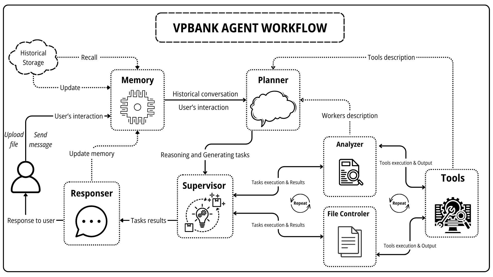

# FINANCIAL AGENT


### [See in details](docs/SystemDesign.pdf)

## Installation

```bash
pip install -r requirements.txt
```

## Running the Server

Start the API server:
```python
   python app.py
```
This will launch the server on the configured host and port (default is usually http://127.0.0.1:8000).

## Launching the Demo UI

Run the Streamlit demo interface:
```bash
   streamlit run streamlit_demo.py
```
## Project Structure
```bash
.
├── app.py               # Main server application
├── streamlit_demo.py    # Streamlit demo UI
├── requirements.txt     # Python dependencies
├── README.md            # This guide
└── other_files...       # Other scripts/modules
```
